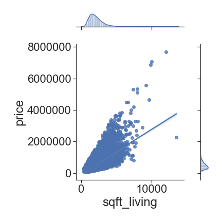
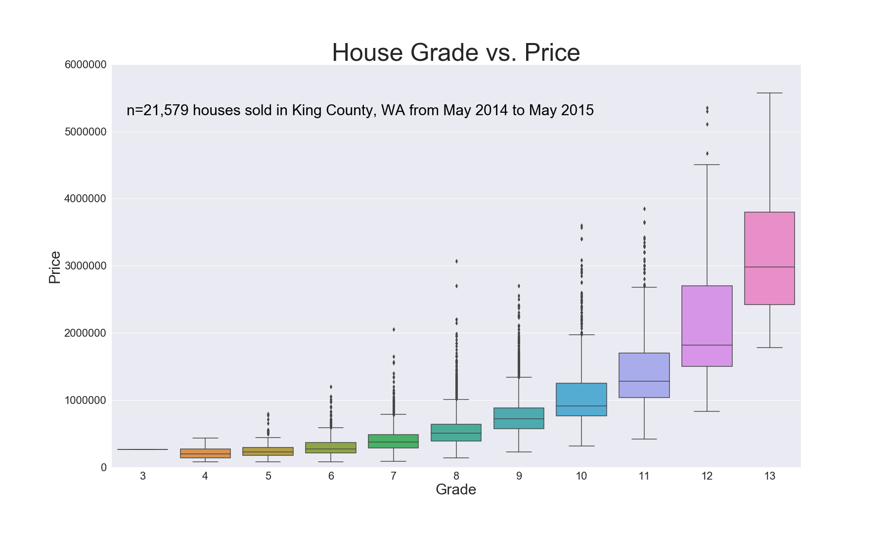
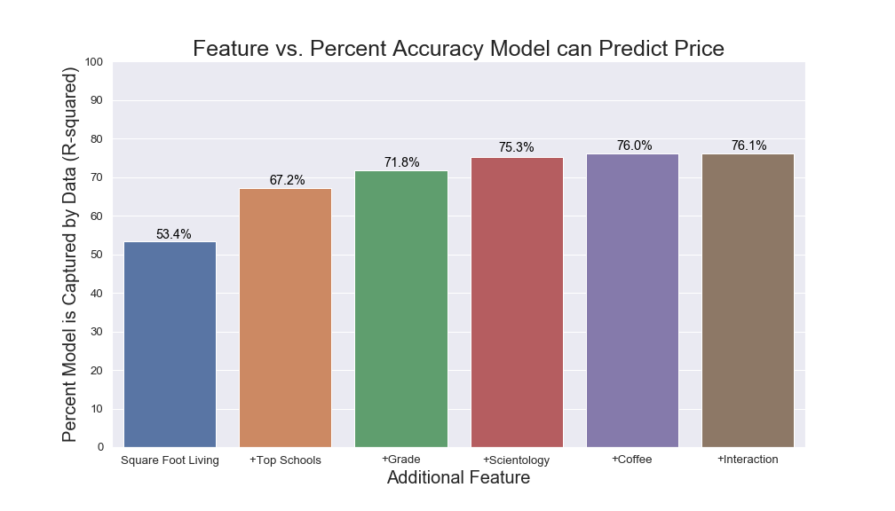

# King County Housing with Multiple Linear Regression

**Authors**: Diane Tunnicliffe, Dana Rausch, Matthew Lipman

## Overview

We have been tasked with analyzing the data of houses in King County. Our goal is to make predictions about the sale price of houses based on certain variables or features, so that they can be used to make profitable decisions by a housing development company. After careful consideration and evaluation of our data, and many iterations of our linear regression models, we have determined that sqare-feet of living space, building grade, and proximity to top schools, great coffee shops, and churches of scientology all are correlated with a higher selling price for a house in King County.

## Business Problem

Our stakeholders in a housing development company are searching for the qualities that lead to higher home sale prices. We will be reviewing building grade, square-footage of living space, and location-related factors such as proximity to schools, coffee shops, parks, and scientology churches to determine which factors are highly correlated with home sale prices.

### Hypotheses

Null hypothesis (H0): There is no relationship between our features and our target variable, price.  

Alternative hypothesis (Ha): There is a relationship between our features and our target variable, price.

We will be using a significance level (alpha) of 0.05 to make our determination, and will make our final recommendations accordingly.

## Data

We utilized a few different data sources for our model so that we could obtain a comprehensive and accurate prediction of home prices. 
* King County House Data: a dataset that we were provided at the onset of the project. This file contains data for 21,597 homes built in King County from 1900 to 2015. Each home in the set contains information regarding features such as number of bedrooms/bathrooms, number of floors, square footage, zip code, condition, and more.  
* Urban Institute Education Data: The Urban Institute is a nonprofit research organization. Their Education Data Explorer "...harmonizes data from all major federal datasets, including the US Department of Education Common Core of Data, the US Department of Education Civil Rights Data Collection, the US Department of Education EDFacts, the US Census Bureau Small Area Income and Poverty Estimates, the US Department of Education Integrated Postsecondary Education Data System, the US Department of Education College Scorecard, and the National Historical Geographic Information System." Custom-generated report provides descriptors such as name and location (lat,long) of school, zip code, and which school district it belongs to.
* Niche.com: school rankings for top King County school districts.
* Yelp API: Used to obtain the top-rated coffee shops for King County.
* Web-scraped data from KingCounty.gov parks website (https://www.kingcounty.gov/services/parks-recreation/parks/parks-and-natural-lands/parksatoz.aspx)
* Scientology church location information from scientology-seattle.org.
* Building grade categorical descriptions from https://info.kingcounty.gov/assessor/esales/Glossary.aspx?type=r.

## Methods

We imported data from reputable sources via web-scraping, API calls, and custom report generation and uploading. We then removed unnecessary data such as duplicates and irrelevant columns. We removed outliers when appropriate, depending upon the criteria we were reviewing. We utilized descriptive statistics as well as visualizations to illuminate trends in the data and isolate key factors for developing profitable homes. We then built multiple linear regression models to determine our strongest correlations, and used an iterative approach to our model-building. We evaluated each model and then returned to the data repeatedly to see what could to be added, changed, or removed to achieve a more successful model. This approach, following the CRISP-DM methodology, was appropriate for analyzing the common attributes of higher-priced homes so that we could make predictions and informed recommendations.

## Results

  


There is a positive correlation between square-feet of living space and home sale price. As sqare-footage of living space increases, house price increases.




There is a positive correlation between building grade and home sale price. As the grade designation increases (scale of 1-13), house price also increases.


There is a negative correlation between distance from a top school and home sale price. As the distance to a top school decreases, house price increases. 


Similarly, we see a negative correlation between distance from a great coffee shop and home sale price.


And surprisingly, we see a negative correlation between distance from a scientology church and home sale price as well. 


 



We found that square-footage of living space had the highest impact on our R-squared value for predicting home price, followed by proximity to top schools, building grade, proximity to a scientology church, and proximity to a highly rated coffee shop.   

Houses that have more square-footage of living space, a higher building grade, and proximity to the above-mentioned features tend to be higher in price.     


The results of our complete analysis were as follows:
* The feature with the highest impact on our R-squared value was square-footage of living space, which was positively correlated with house prices.
* The feature with the next-highest impact was distance to a top school, which was negatively correlated with house prices. 
* The feature with the next-highest impact was building grade, which was positively correlated with house prices.  
* The feature with the next-highest impact was distance to a scientology church, which was negatively correlated with house prices.
* The feature with the next-highest impact was distance to a great coffee shop, which was negatively correlated with house prices.
* The interaction between distance to a top school and distance to a scientology church was significant, as there was multicolinearity between the two. Accounting for this interaction showed improvement to our model.
* And finally, the feature with the least impact was distance to a park, which had no significant impact on our model.

We are confident that the results we extrapolated from this analysis would generalize beyond the data that we have. By looking at the available data, the trends and correlations we found were true for houses built from 1900 to 2015, so we are confident that they would hold true for houses built today. Despite the global pandemic, people are still buying and selling their homes. We have seen that children are still largely attending schools, and we speculate that people continue to desire a well-built homes with a large amount of living space, now more than ever. And the data has shown that people tend to pay more for a home that's near a good coffee shop and a scientology church!

If the recommendations that we made are put to use, we are confident that King County Developers will have a successful career in the housing market. From the data, it is clear that all the attributes we have discussed are correlated with high home sale prices, which is exactly what King County Developers will want for their projects.


## Conclusions

Our best model had an R-squared value of 0.761, telling us that the model fit the data with an accuracy of 76%. After reviewing this final iteration, we felt confident in our recommendations that all of our available features except parks be considered by home developers in order to increase selling price. Sqare-feet of living space, building grade, distance to great schools, coffee shops, and churches of scientology, as well as the interaction between schools and scientology churches, all play a valuable role in predicting the price of a house in King County.

The prob(F-statistic) of 0.00 tells us that there is an extremely low probability of achieving these results with the null hypothesis being true, and tells us that our regression is meaningful. Our p-values for our features are well below our alpha or significance level, showing that they are each contributing to the model significantly. With an alpha of 0.05, at a confidence level of 95%, we reject the null hypothesis that there is no relationship between our features and our target variable, price.

## Recommendations

Our recommendations are as follows:
* increase square-footage of living space
* attain the highest possible building grade
* build and develop homes in close proximity to a top school district
* build and develop homes in close proximity to a highly-rated coffee shop
* build and develop homes in close proximity to a scientology church

By following the above recommendations, a housing development company in King County can increase their chances of selling higher-priced homes.

## Future Work

In the future, our next steps would be reducing noise in the data to improve the accuracy of our model. Additionally, we would like to investigate certain features, such as constructional/architectural values of the house, to see what trends we could discern from that. Some ideas would be whether basements are correlated with higher house prices, or whether the amount of bathrooms has an impact. 

## For More Information

Please review our full analysis in [our Jupyter Notebook](./business_problem_and_data_understanding.ipynb) or our [presentation](./house_slides.pdf).

For any additional questions, please contact:
* **Diane Tunnicliffe** at diane.j.tunnicliffe@gmail.com 
* **Matthew Lipman** at matthew.lipman@wework.com
* **Dana Rausch** at dana.rausch5@gmail.com

## Repository Structure


```
├── README.md                        <- The top-level README for reviewers of this project
├── business_problem_and...ipynb     <- First Jupyter notebook. Overview, Business Problem, Data Understanding.
├── data_preparation.ipynb           <- Second Jupyter notebook. Data scrubbing, transformation, compilation.
├── models.ipynb                     <- Third Jupyter notebook. Linear regression models, evaluations, results.
├── visualizations.ipynb             <- Fourth Jupyter notebook. Supporting visualizations, folium maps.
├── house_slides.pdf                 <- PDF version of project presentation
├── house_notebook.pdf               <- PDF version of Jupyter notebooks
├── data                             <- Both sourced externally and generated from code
└── images                           <- Both sourced externally and generated from code
```
